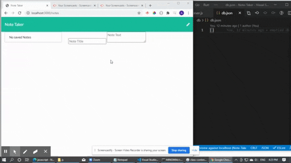

# Note-Taker

## Description
This is a simple note taker app where the user can save text notes, view previously saved text notes, and delete notes. This is made possible by ExpressJS. 

## Visuals

## Repository / Deployment
Repository is located [here](https://github.com/awpdev/Note-Taker).

[Here](https://pacific-headland-65125.herokuapp.com/) is a link to the deployed site.

## Usage
Click on the 'Get Started' button. To save a note, input both text title and text note, then click on the disk icon on the upper-right corner. Click on a previously saved note on the left sidebar to read the note. To enter a new note, click on the pen icon on the upper-right corner.

## Questions
Please refer to my [Github](https://www.github.com/awpdev).

Also contact me via [email](mailto:apark999@gmail.com) with your inquiries.

## Credits
Here are some references I used that helped me create this:

Code and examples from Trilogy Education Services 
Built-in front-end code 
expressjs.com
Mozilla MDN

## License
This project is under MIT.
